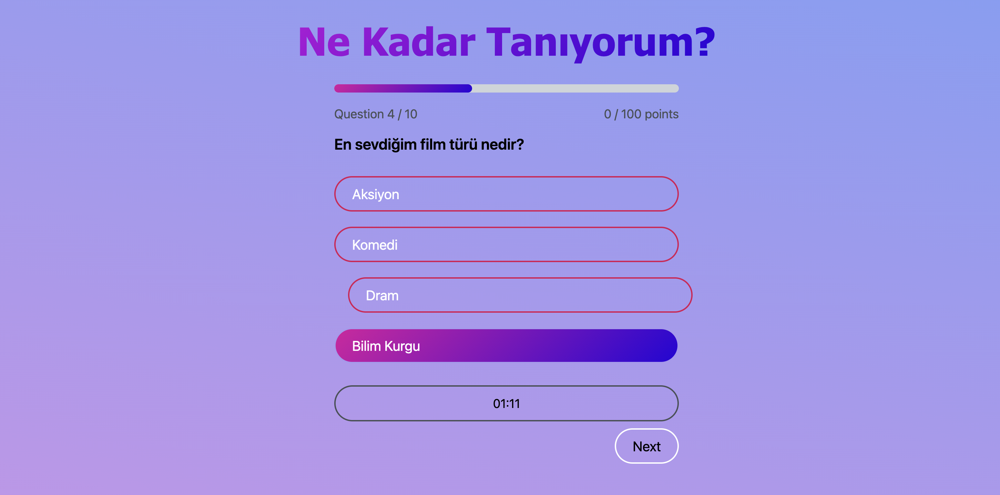

# 🧠 QuestionTest



Bu proje, kullanıcıların birbirlerini ne kadar tanıdıklarını test etmek için tasarlanmış interaktif bir web uygulamasıdır.

## 📋 Proje Hakkında

QuestionTest, kullanıcıların birbirleri hakkında ne kadar bilgi sahibi olduklarını ölçen eğlenceli bir test uygulamasıdır. Her kullanıcı, kendisi hakkında sorular oluşturarak başlar. Diğer kullanıcılar bu soruları yanıtlar ve sonuçlar kaydedilir. Herkes birbirinin sonuçlarını görebilir ve kimin kimi daha iyi tanıdığını keşfedebilir.

## ✨ Özellikler

- Kullanıcı kaydı ve oturum yönetimi
- Kişiselleştirilmiş soru oluşturma
- Test yanıtlarının kaydedilmesi
- Sonuçların görselleştirilmesi
- Kullanıcılar arası karşılaştırma

## 🛠️ Teknolojiler

- React 19
- Vite
- Supabase (backend ve veritabanı)
- React Query (veri yönetimi)

## 🚀 Kurulum

1. Depoyu klonlayın:
```
git clone https://github.com/ahmetyusufer/questionTest.git
cd questiontest
```

2. Bağımlılıkları yükleyin:
```
npm install
```

3. Supabase projenizi oluşturun ve `services/supabase.js` dosyasında gerekli ortam değişkenlerini ayarlayın:
```
supabaseUrl=your_supabase_url
supabaseKey=your_supabase_anon_key
```
4. Supabase tablo adınızı `services/apiLeaderedTable.js` dosyasında gerekli değişkenleri ayarlayın:
```
tableName = your_supabase_table_name
supabasenizdeki tableValue: {name, score} olmalı 
```

5. Geliştirme sunucusunu başlatın:
```
npm run dev
```

## Kullanım

1. Uygulamaya kaydolun veya giriş yapın
2. Kendiniz hakkında sorular oluşturun(`data/questions.json`)
3. Diğer kullanıcıların testlerini çözün
4. Sonuçları görüntüleyin ve karşılaştırın
